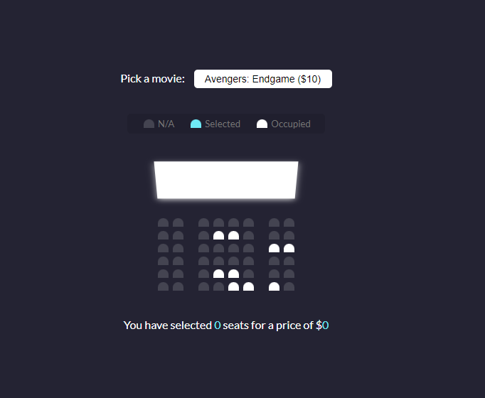
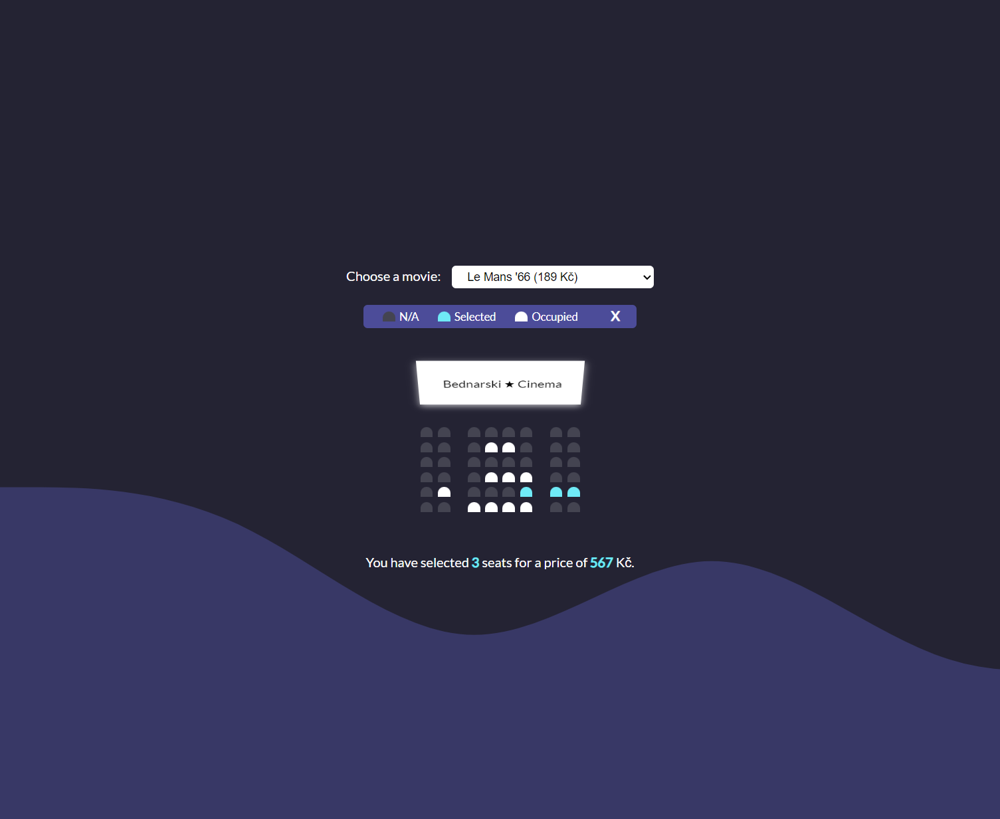

# Udemy--vanillawebprojects-02

**The second** of a series of **20 small projects** in **Vanilla JavaScript** from the [**Udemy course**](https://www.udemy.com/course/web-projects-with-vanilla-javascript/) by author [Brad Traversy](https://www.traversymedia.com/) with this [Brad's original GitHub repository](https://github.com/bradtraversy/vanillawebprojects).

# 02: Movie Seat Booking

Display movie choices and seats in a theater to select from in order to purchase tickets

## Project Specifications

- Display UI with movie select, screen, seats, legend & seat info
- User can select a movie/price
- User can select/deselect seats
- User can not select occupied seats
- Number of seats and price will update
- Save seats, movie and price to local storage so that UI is still populated on refresh
- Design inspiration from [Dribbble](https://dribbble.com/shots/3628370-Movie-Seat-Booking)

## Original preview

    

## My solution preview

    

## My solution specifications

- Price is in **Czech crowns (Kč)** value.
- Added an "**X**" button to clear choice and LocalStorage.
- Added **wave pattern** to the background.

# Author

Website - [Petr Bednarski](https://github.com/pettik)  
Frontend Mentor - [@pettik](https://www.frontendmentor.io/profile/pettik)
